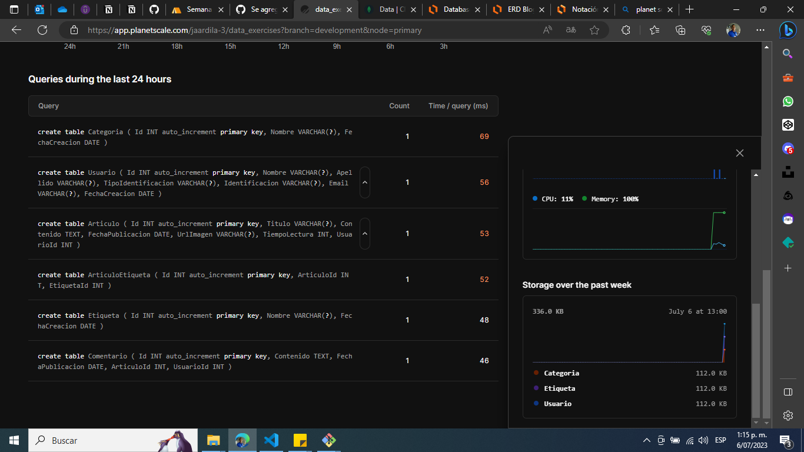

# Ejercicio Semana 9
## Script SQL para crear las tablas del Blog
- Los indices a medida que se necesiten se iran creando posteriormente

```
CREATE TABLE Categoria (
  Id INT AUTO_INCREMENT PRIMARY KEY,
  Nombre VARCHAR(255),
  FechaCreacion DATE
);

CREATE TABLE Etiqueta (
  Id INT AUTO_INCREMENT PRIMARY KEY,
  Nombre VARCHAR(255),
  FechaCreacion DATE
);

CREATE TABLE Usuario (
  Id INT AUTO_INCREMENT PRIMARY KEY,
  Nombre VARCHAR(255),
  Apellido VARCHAR(255),
  TipoIdentificacion VARCHAR(255),
  Identificacion VARCHAR(255),
  Email VARCHAR(255),
  FechaCreacion DATE
);

CREATE TABLE Articulo (
  Id INT AUTO_INCREMENT PRIMARY KEY,
  Titulo VARCHAR(255),
  Contenido TEXT,
  FechaPublicacion DATE,
  UrlImagen VARCHAR(255),
  TiempoLectura INT,
  UsuarioId INT
);

CREATE TABLE ArticuloEtiqueta (
  Id INT AUTO_INCREMENT PRIMARY KEY,
  ArticuloId INT,
  EtiquetaId INT
);

CREATE TABLE Comentario (
  Id INT AUTO_INCREMENT PRIMARY KEY,
  Contenido TEXT,
  FechaPublicacion DATE,
  ArticuloId INT,
  UsuarioId INT
);
```
## Pantallazos PlanetScale

